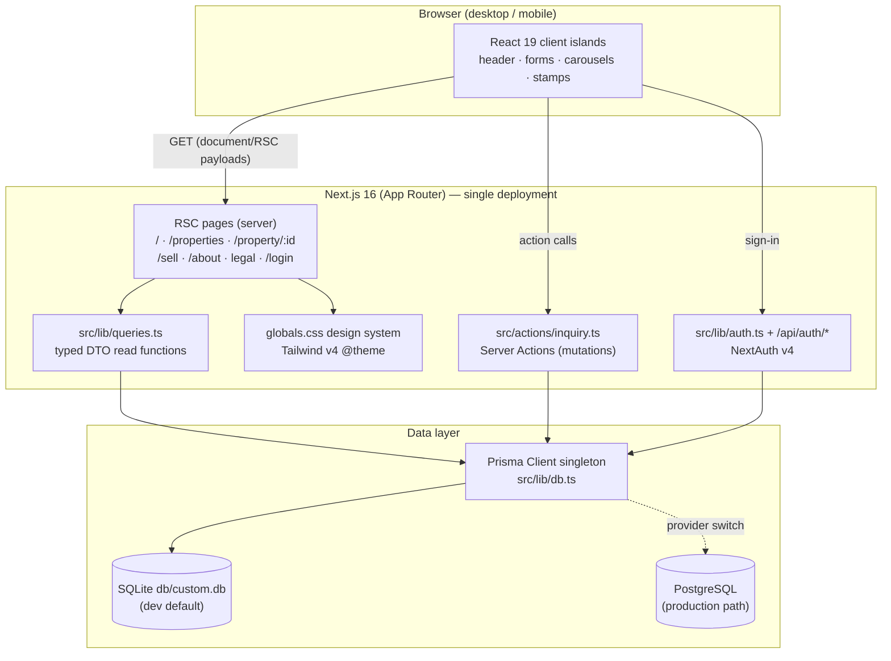
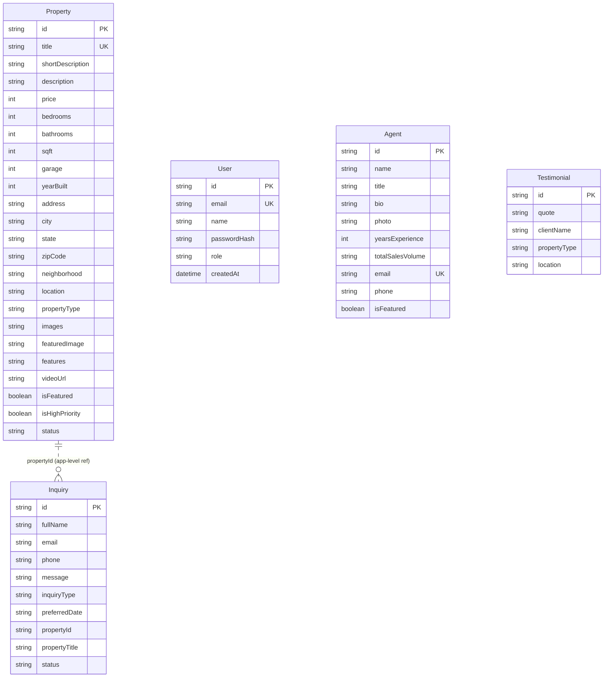

# MAISON ESTATE — Master Project Architecture Document (PAD) v1.0

**Classification:** Internal Engineering Reference
**Status:** DEFINITIVE, PRODUCTION-LOCKED BLUEPRINT
**Companion Document:** README.md (product overview), AGENTS.md (agent instructions), CLAUDE.md (engineering conventions)
**Last Updated:** 2026-09-20
**Audience:** Senior Engineers, Tech Leads, DevOps, and Onboarding Engineers
**Rule:** Every architectural decision in this document traces to a specific rationale. Nothing is here "because it's popular."

## Revision History

| Version | Date | Change | Tag |
| --- | --- | --- | --- |
| 1.0 | 2026-09-20 | Initial as-built document from the completed build | [SYN] |

Tags: `[RES]` Resolution · `[SR]` Scope Revision · `[CA]` Corrective Action · `[SYN]` Sync/Refresh · `[SAN]` Sanity Check · `[AUTH]` Authoritative Clarification

## Table of Contents

1. [System Overview & Decisions](#1-system-overview--decisions)
2. [High-Level System Topology](#2-high-level-system-topology)
3. [Application Architecture](#3-application-architecture)
4. [Data Architecture](#4-data-architecture)
5. [Design System Reference](#5-design-system-reference)
6. [Security Architecture](#6-security-architecture)
7. [Testing Strategy](#7-testing-strategy)
8. [Build & Deployment](#8-build--deployment)
9. [Developer Handbook](#9-developer-handbook)
10. [Known Issues & Outstanding Tasks](#10-known-issues--outstanding-tasks)
11. [Key Files Reference](#11-key-files-reference)
12. [Glossary](#12-glossary)

---

## 1. System Overview & Decisions

### 1.1 Document Metadata & Purpose

MAISON ESTATE is a luxury real-estate agency web application — a faithful,
production-grade clone of the original Base44 application at
`https://real-estate-agency.base44.app/`. This document records the as-built
architecture: stack decisions with rationale, the layer model, data design,
the design-token system, security posture, testing, and operations. It exists
so future maintainers can change the system without reverse-engineering it.

### 1.2 Technology Stack Summary

| Layer | Technology | Version | Key Rationale |
| --- | --- | --- | --- |
| Web framework | Next.js (App Router) | 16.x | Server Components give zero-client-JS data reads; Server Actions replace a REST layer; aligned with the reference architecture (scandihaven) the clone was commissioned from |
| UI runtime | React | 19.x | Required by Next 16; function-component + hooks model |
| Language | TypeScript, `strict` | 5.x | Compile-time contracts across DTOs, actions, and props |
| Styling | Tailwind CSS (CSS-first `@theme`) | 4.x | Reproduces the original app's exact token system; no config file drift |
| Component primitives | shadcn/ui + Radix | current | Accessible Select/Input/Textarea foundations; original app is itself shadcn-based |
| Animation | framer-motion | 12.x | The original's hero, reveals, rotating stamps, and parallax are motion-defining |
| ORM | Prisma | 6.x | Typed schema + client; SQLite dev / PostgreSQL prod with one provider switch |
| Auth | NextAuth v4 | 4.24 | Credentials provider matches the original login flow; JWT sessions; Google optional |
| Validation | Zod | 4.x | Single dialect for action input contracts and tests |
| Unit/integration tests | Vitest | 5.x | Fast node-environment runner; runs actions against the real DB |
| Toasts | sonner | 2.x | Inquiry/newsletter feedback |
| Package manager / runtime | Bun | ≥ 1.1 | Single toolchain for install, scripts, and tsx-style seed execution |

### 1.3 Architecture Decision Records

**ADR-001: Single Next.js application (not a monorepo)**
- **Context:** The commissioning reference (scandihaven) is a pnpm + Turborepo
  monorepo with separate storefront/admin apps and shared packages.
- **Decision:** Build a single Next.js app with an internal layer structure
  (`app/`, `components/site/`, `lib/`, `actions/`).
- **Rationale:** The original Base44 app is one public site with a login —
  there is no back-office surface to split out. A single app removes workspace
  tooling overhead, keeps every file one hop from the route that uses it, and
  still enforces the same seams (queries vs actions vs UI).
- **Consequences:** No cross-package dependency rules needed; the layer
  discipline moves to conventions documented here and in AGENTS.md.
- **Alternatives Rejected:** pnpm/Turborepo monorepo (justifiable only with a
  second app or shared packages); separate API service (Server Actions
  suffice for this mutation surface).

**ADR-002: Server Actions as the only mutation seam**
- **Context:** The app persists inquiries and newsletter subscriptions from
  public forms; the original called a hosted SDK from the client.
- **Decision:** All writes flow through `"use server"` functions in
  `src/actions/inquiry.ts` returning a typed `ActionResult<T>` union; no REST
  endpoints exist for UI mutations.
- **Rationale:** One place to validate (Zod), rate-limit, log, and translate
  persistence failures into user-safe messages. Typed results prevent throws
  across the RSC boundary and keep failure paths testable.
- **Consequences:** Client components call actions directly; the only route
  handler is NextAuth's `/api/auth/[...nextauth]`.
- **Alternatives Rejected:** Route handlers per mutation (validation and error
  mapping would be duplicated); client-side SDK calls (secrets and validation
  logic would ship to the browser).

**ADR-003: SQLite for development, PostgreSQL for production**
- **Context:** The reference stack uses PostgreSQL 17; the build environment
  must run with zero external services.
- **Decision:** Ship SQLite (`db/custom.db`) as the default `DATABASE_URL`
  with string-union "enums" and JSON-text array columns; document the
  one-switch PostgreSQL path in `.env.example` and the README.
- **Rationale:** Anyone can `bun install && db:push && db:seed && dev` with
  no server. String columns + `constants.ts` canonical lists keep the schema
  portable across both engines instead of engine-specific enum types.
- **Consequences:** Array fields need `parseJsonArray()` at the DTO boundary;
  referential checks for `Inquiry.propertyId` are application-level.
- **Alternatives Rejected:** Postgres-only (blocks zero-config local runs);
  an ORM-agnostic repository layer (no second engine is actually in use).

**ADR-004: URL as the source of truth for listing filters**
- **Context:** The /properties page filters by search text, location, type,
  price band, and beds; the original mirrored filter state in React state.
- **Decision:** Derive filter values from `searchParams` on every render;
  every change pushes a new URL; only the free-text input keeps a local
  draft.
- **Rationale:** Shareable, back/forward-correct views with no state-sync
  effects — which also satisfies the `react-hooks/set-state-in-effect` rule.
- **Consequences:** The page must `await searchParams` (Next 16 async props).
- **Alternatives Rejected:** Local state + effect syncing from the URL
  (lint-flagged, double render); global store (unnecessary for one page).

**ADR-005: Credentials auth seeded with the original demo user**
- **Context:** The original app's login accepts
  `sepnetflix2023@outlook.com` / `$Abcd1234`; a clone should authenticate the
  same way out of the box.
- **Decision:** NextAuth v4 Credentials provider against the `User` table
  (bcrypt hashes); the seed creates that demo user; Google OAuth is wired but
  disabled until env keys are provided.
- **Rationale:** Functional parity with the original sign-in flow; no secret
  in the repo (the demo password is intentionally public demo data, hashed at
  seed time).
- **Consequences:** JWT sessions; no OAuth-only features; signup is not
  implemented (mirrors the original's template behavior).
- **Alternatives Rejected:** Better-Auth (heavier than this surface needs);
  disabling auth entirely (would regress the /login page parity).

**ADR-006: Reproduce the original design tokens exactly**
- **Context:** The brief is a pixel-faithful clone; the original's CSS was
  fully extractable.
- **Decision:** Port the original `:root` HSL variables, custom classes
  (`.ghost-btn`, `.hairline`, `.text-display-*`, `.tracking-*`), fonts
  (Instrument Serif + Inter), `--radius: 9999px` pill geometry, and media
  assets into `globals.css` / `public/media`.
- **Rationale:** Token fidelity is cheaper and more robust than approximating
  visuals per-component; any future rebrand changes one file.
- **Consequences:** Components may use brand classes alongside Tailwind
  utilities; shadcn primitives inherit the pill radius (matching the
  original, which is also shadcn-based).
- **Alternatives Rejected:** Rebuilding with default shadcn theme (loses the
  editorial identity); CSS-in-JS (fights Tailwind v4).

---

## 2. High-Level System Topology



Runtime notes: pages are `force-dynamic` (listing data must be fresh and the
filter set is user-driven); static assets (video, imagery, fonts) are served
from `public/media` and `next/font` with immutable caching. There are no
external service calls at request time — the Google Maps embed is an iframe,
not an API dependency.

---

## 3. Application Architecture

### 3.1 Layer Model

| # | Layer | Location | Responsibility | Golden Rule |
| --- | --- | --- | --- | --- |
| L0 | Presentation shell | `app/layout.tsx`, `components/site/{site-header,site-footer}` | Fonts, metadata, header/footer chrome | Branding/positioning bugs are fixed here, never per-page |
| L1 | Pages (RSC) | `app/**/page.tsx` | Compose sections, read data via queries, await async props | Data-read bugs are fixed in `lib/queries.ts`, not in components |
| L2 | Client islands | `components/site/*` (`"use client"`) | Interactivity: forms, filters, carousel, gallery, menu | Server is the source of truth; islands hold only UI/draft state |
| L3 | Mutations | `actions/inquiry.ts` | Validate → rate-limit → persist; typed results | Never throw across the boundary; always return `ActionResult<T>` |
| L4 | Data access | `lib/{db,queries}.ts`, `prisma/*` | Prisma client, DTO mapping, schema, seed | One client singleton; DTOs are the only shapes pages see |

### 3.2 Annotated Directory Structure

```text
real-estate-agency/
├── src/
│   ├── app/
│   │   ├── layout.tsx              ← fonts, metadata, sonner toaster
│   │   ├── globals.css             ← THE design system (tokens + brand classes)
│   │   ├── page.tsx                ← home: hero, featured, neighborhoods, services, advisors, testimonials, parallax
│   │   ├── not-found.tsx           ← editorial 404
│   │   ├── properties/page.tsx     ← listings; awaits searchParams; renders filter bar + grid
│   │   ├── property/[id]/page.tsx  ← detail; gallery, stats, features, map, sticky inquiry
│   │   ├── sell/page.tsx           ← seller hero, coverage checklist, contact form
│   │   ├── about/page.tsx          ← legacy, advisors (DB), credentials, community, contact
│   │   ├── login/page.tsx          ← credentials sign-in (Google gated by env)
│   │   ├── privacy|terms|accessibility/page.tsx ← LegalPage wrapper
│   │   └── api/auth/[...nextauth]/route.ts      ← the ONLY route handler
│   ├── actions/
│   │   ├── inquiry.ts              ← submitInquiry + subscribeNewsletter (Server Actions)
│   │   └── inquiry.test.ts         ← action integration tests (real DB)
│   ├── components/
│   │   ├── site/                   ← header, footer, hero-search, property-card, stamps,
│   │   │                              property-gallery, inquiry-form(+toast), properties-filters,
│   │   │                              testimonial-carousel, parallax-image, newsletter-form,
│   │   │                              legal-page, reveal (client boundary for motion)
│   │   └── ui/                     ← shadcn primitives (select, input, textarea, sonner…)
│   ├── lib/
│   │   ├── db.ts                   ← Prisma singleton
│   │   ├── queries.ts              ← DTO types + read functions + filter engine
│   │   ├── constants.ts            ← canonical filter lists, neighborhoods, site facts
│   │   ├── format.ts               ← formatPrice / formatSqft / parseJsonArray
│   │   ├── auth.ts                 ← NextAuth options (credentials + optional Google)
│   │   └── format.test.ts          ← unit tests for helpers + constants
│   └── types/next-auth.d.ts        ← session user.id augmentation
├── prisma/
│   ├── schema.prisma               ← Property, Agent, Testimonial, Inquiry, User
│   └── seed.ts                     ← idempotent upserts + demo login user
├── public/media/                   ← hero video, neighborhoods, page imagery, 30 listing photos, agent portraits
├── docs/screenshots/               ← dev-server captures for documentation
├── .env.example                    ← every variable with documented defaults
├── AGENTS.md / CLAUDE.md / README.md / Project_Architecture_Document.md
└── eslint.config.mjs · tsconfig.json · vitest.config.ts · package.json
```

### 3.3 Critical Code Patterns

**Pattern 1 — Server Action result union (the mutation contract)**

```ts
// src/actions/inquiry.ts — every mutation returns this shape; nothing throws.
export type ActionResult<T> =
  | { ok: true; data: T }
  | { ok: false; error: { code: ErrorCode; message: string; fieldErrors?: Record<string, string[]> } };

// Why this pattern: client components branch on `ok` and render either the
// success toast or field-level errors; test code asserts codes directly;
// internal failures are logged server-side with context but never leak
// details to the browser.
```

**Pattern 2 — DTO mapping at the data boundary**

```ts
// src/lib/queries.ts — DB rows never reach components; DTOs decode JSON columns.
function toPropertyDto(p: Property): PropertyDto {
  return { ...p, images: parseJsonArray(p.images), features: parseJsonArray(p.features), createdAt: p.createdAt.toISOString() };
}
// Why: JSON-text columns (SQLite portability, ADR-003) are decoded exactly
// once, dates are serialized once, and every consumer gets stable types.
```

**Pattern 3 — URL-derived filters (no state-sync effects)**

```tsx
// src/components/site/properties-filters.tsx
const filters = {
  search: searchParams.get("search") ?? "",
  type: searchParams.get("type") ?? "All Types",
  /* … */
};
const pushFilters = (overrides) => router.push(`/properties?${buildParams({ ...filters, ...overrides })}`);
// Why: the URL is the single source of truth — shareable views, working
// back/forward, and no `useEffect` state mirroring (lint-clean).
```

**Pattern 4 — Client boundary for motion in server pages**

```tsx
// src/components/site/reveal.tsx
"use client";
export function Reveal({ children, delay, duration, className }) {
  return <motion.div initial={{ opacity: 0, y: 20 }} whileInView={{ opacity: 1, y: 0 }} …>{children}</motion.div>;
}
// Why: framer-motion cannot run in Server Components; pages compose <Reveal>
// for scroll animations while staying server-rendered.
```

**Pattern 5 — Signature rotating stamp (brand-defining detail)**

```tsx
// src/components/site/stamps.tsx
<motion.svg viewBox="0 0 100 100" animate={{ rotate: 360 }}
            transition={{ duration: 20, repeat: Infinity, ease: "linear" }}>
  <circle cx="50" cy="50" r="50" fill={fill} />
  <text …><textPath href={`#${pathId}`}>{label}</textPath></text>
</motion.svg>
// Why: the original app's "NEW" / "OPEN HOUSE" circular stamps are part of
// its identity; reproducing them as SVG + motion keeps them crisp at any
// size and animates exactly like the source (20s linear rotation).
```

---

## 4. Data Architecture

### 4.1 Database Schema



### 4.2 Data Models

- **Property** — the listing aggregate. `images`/`features` are JSON-text
  arrays (decoded via `parseJsonArray`); `price` is integer USD; `location`
  drives the filter list; `isFeatured` selects the home page rail;
  `isHighPriority` toggles the rotating NEW stamp.
- **Agent** — advisor profiles; `isFeatured` picks the three on the home
  page; all agents render on /about.
- **Testimonial** — quote, client name, property type, location; newest five
  drive the auto-rotating carousel.
- **Inquiry** — the lead-capture record for property inquiries, the /sell
  contact form, the /about contact form, and newsletter subscriptions
  (sentinel fields: `fullName = "Newsletter Subscriber"`, `message =
  "Newsletter subscription"` — parity with the original app). `propertyId`
  is verified to exist inside the action before insert.
- **User** — credentials-auth user; the seed inserts the demo account with a
  bcrypt hash (cost 12).

### 4.3 Persistence Strategy

Reads: RSC pages call `queries.ts` functions; listing pages are
`force-dynamic`. Writes: Server Actions only, validated by Zod, rate-limited
(5 submissions / 60s / email in-process), wrapped in try/catch that logs
context and returns `INTERNAL` on unexpected failure. Seeding is idempotent —
properties upsert by `title`, agents by `email`, the demo user by `email`;
testimonials are cleared and re-created. `db:push` (not migrations) is the
documented local path; production may adopt `prisma migrate` once the
PostgreSQL provider switch is made.

---

## 5. Design System Reference

### 5.1 Typographic System

| Role | Family | Weights | Notes |
| --- | --- | --- | --- |
| Display / headings | Instrument Serif | 400 (+italic) | `--font-display-src`; sizes via `.text-display-xl` clamp(3rem→7rem) · `-lg` clamp(2.5→4.5rem) · `-md` clamp(2→3rem) · `-sm` clamp(1.5→2rem) |
| Body / UI | Inter | 300–600 | `--font-body`; labels use `.tracking-label` (0.15em) uppercase |

### 5.2 Color Tokens (`:root`, HSL)

| Token | Value | Use |
| --- | --- | --- |
| `--background` | `30 20% 97%` | Warm editorial cream |
| `--foreground` | `0 0% 10%` | Near-black text / footer surface |
| `--primary` | `0 0% 10%` | Buttons |
| `--secondary` / `--muted` | `30 10% 90%` | Subtle surfaces |
| `--muted-foreground` | `30 5% 35%` | Secondary text |
| `--accent` | `35 65% 36%` | Bronze-gold accent (prices, active nav, icons) |
| `--border` | `30 12% 88%` | Hairlines and card borders |
| `--radius` | `9999px` | The pill geometry everything inherits |
| Stamp fills | `#FFFFA3` (NEW) · `#F2CC65` (OPEN HOUSE) · `#facca3` (light gold on dark) | Signature yellows |

Body text on `--background` and white on `--foreground` both exceed WCAG AA
contrast; accent is reserved for large/bold or non-essential decoration.

### 5.3 Component Primitives

Brand classes (in `globals.css`): `.ghost-btn` (pill, 1px foreground border,
transparent, uppercase, 0.1em tracking), `.ghost-btn-light` (white variant
for hero), `.hairline` (0.5px rule), `.tracking-editorial` (−0.02em),
`.tracking-label` (0.15em). Layout rhythm: `max-w-[1400px]`/`[1600px]`
containers with `px-[2%]`/`[4%]`, section padding `py-24 md:py-40`, header
`h-14 md:h-16` fixed. shadcn primitives (Select, Input, Textarea) are
restyled via the tokens — e.g. filter selects render as pills.

### 5.4 Motion

framer-motion: hero fade-up (1s, 0.3s delay); scroll reveals (`<Reveal>`,
0.6s, 0.1s stagger); card image zoom (1.2s ease-out); rotating stamps (20s
linear); testimonial crossfade (0.5s, 4s auto-advance); parallax band
(scroll-linked −15%); header hide-on-scroll-down with 700ms transitions. All
motion is disabled under `prefers-reduced-motion` via the globals rule.

---

## 6. Security Architecture

### 6.1 Security Rules

| Rule | Enforcement |
| --- | --- |
| All action input validated (Zod) before persistence | `inquirySchema.safeParse` in `submitInquiry`; failures return `VALIDATION` with field errors |
| Public form abuse bounded | In-process rate limiter — 5 submissions / 60s / normalized email → `RATE_LIMITED` |
| No secrets in client bundles | Only `NEXT_PUBLIC_*` vars referenced client-side; auth secrets stay server-side |
| Passwords never stored or logged in clear | bcrypt (cost 12) hashes; logs record inquiry type/property id only, never payloads |
| Referential integrity for lead records | `propertyId` existence verified inside the action → `NOT_FOUND` for stale ids |
| CSRF posture | Server Actions are POST-only with Next's built-in action-id binding; NextAuth handlers carry their own CSRF tokens |
| Session security | JWT strategy, `NEXTAUTH_SECRET` signing, httpOnly cookies via NextAuth defaults |
| Dependency hygiene | `bun audit` before releases; lockfile committed |

### 6.2 Security Utilities

`bcryptjs` (hashing in seed + authorize), Zod (input contracts), the rate
limiter map in `src/actions/inquiry.ts`.

### 6.3 AuthN / AuthZ

Authentication: NextAuth v4 Credentials provider (email + bcrypt check
against `User`); optional Google provider enabled only when both env keys
exist and `NEXT_PUBLIC_GOOGLE_ENABLED="true"`. Sessions: JWT strategy with
`sub` carrying the user id; pages use no session-gated views — matching the
original app, where the public site is identical signed-in or not.
Authorization: single `role` column reserved for future back-office gating;
no privileged surface exists yet, so no permission matrix is warranted
(YAGNI — revisit if an admin area is added).

### 6.4 Threat Model (surface-level)

| Threat | Mitigation |
| --- | --- |
| Form spam / flooding | Rate limiter + required fields + honeypot-ready structure |
| Injection via form fields | Prisma parameterized queries; no string interpolation into SQL; React escapes output |
| Credential stuffing on /login | bcrypt verify cost; failed sign-ins return a single generic error |
| Stale-property inquiries | Existence check inside the action |
| Secret leakage | `.env` git-ignored; `.env.example` carries sentinels only; demo password is intentionally public demo data |

---

## 7. Testing Strategy

### 7.1 Test Distribution

| Level | Location | Count | Covers |
| --- | --- | --- | --- |
| Unit | `src/lib/format.test.ts` | 9 | Price/sqft formatting, JSON-array parsing, canonical constants and price-band contiguity |
| Integration (actions, real DB) | `src/actions/inquiry.test.ts` | 7 | Validation paths, unknown inquiry type, not-found property, rate limiting, happy-path persistence, newsletter sentinel behavior |

### 7.2 Test Patterns

Tests import production modules directly (no mocking of the DB or actions) —
asserting observable behavior: returned `ActionResult` codes and persisted
rows. Unique emails per case prevent cross-test rate-limit coupling; the
rate-limit test intentionally floods one address.

### 7.3 Coverage Thresholds

Formal thresholds are not yet configured; the tested surface is the entire
mutation seam plus all pure helpers. Adding thresholds (e.g. 85% lines on
`lib/` + `actions/`) is a tracked task (see §10).

### 7.4 Pre-PR / Pre-Deploy Checklist

1. `bun run lint` — zero errors/warnings.
2. `bun run typecheck` — clean.
3. `bun run test` — all passing.
4. Browser-verify affected flows (hero search → filters → detail → inquiry;
   login with demo credentials; newsletter; mobile menu).
5. `tail dev.log` — no runtime errors from the session.
6. `bun audit` before deploys.

---

## 8. Build & Deployment

### 8.1 Production Build

```bash
bun install
bun run build   # next build (standalone output)
bun run start   # serves the standalone build
```

### 8.2 Environment Variables

| Name | Required | Default | Description |
| --- | --- | --- | --- |
| `DATABASE_URL` | Yes | `file:./db/custom.db` | SQLite path (dev) or PostgreSQL URL (prod; switch provider first) |
| `NEXTAUTH_SECRET` | Yes | — | Session signing secret; generate with `openssl rand -base64 32` |
| `NEXTAUTH_URL` | Yes | `http://localhost:3000` | Canonical origin for auth callbacks/redirects |
| `GOOGLE_CLIENT_ID` | No | — | Google OAuth client id |
| `GOOGLE_CLIENT_SECRET` | No | — | Google OAuth client secret |
| `NEXT_PUBLIC_GOOGLE_ENABLED` | No | `false` | `"true"` surfaces the Google button on /login |
| `NEXT_PUBLIC_SITE_URL` | No | `http://localhost:3000` | Metadata / OG origin |

### 8.3 Docker Configuration

None shipped. The app is a standard Next.js standalone build; the reference
stack's `postgres:17-alpine` compose pattern applies directly when the
PostgreSQL switch is made (see §10).

### 8.4 CI/CD Pipeline

No hosted CI yet (no `.github/workflows`); the local gate — lint →
typecheck → test → browser spot-check — is the release gate, per the repo's
operator contract. Adding GitHub Actions running the same three commands is
a tracked task.

---

## 9. Developer Handbook

### 9.1 Local Setup

```bash
bun install
cp .env.example .env
bun run db:push && bun run db:seed
bun run dev          # http://localhost:3000
```

Demo login: `sepnetflix2023@outlook.com` / `$Abcd1234`.

### 9.2 Common Commands

| Command | Location | Purpose |
| --- | --- | --- |
| `bun run dev` | repo root | Dev server on :3000, logs to `dev.log` |
| `bun run lint` / `typecheck` / `test` | repo root | Quality gates |
| `bun run db:push` | repo root | Sync schema to DB |
| `bun run db:seed` | repo root | Idempotent demo data |
| `bunx vitest run <file>` | repo root | Single test file |

### 9.3 Code Style Rules

- TypeScript strict; no `any`; `import type` for types.
- Server Components by default; `"use client"` only for interactive leaves.
- Brand tokens/classes over ad-hoc values; no `tailwind.config.js`.
- Mutations only via Server Actions returning `ActionResult<T>`.
- Comments explain why; conventional commits, atomic scope.

### 9.4 Git Workflow

`main` only; Conventional Commits (`feat:`, `fix:`, `docs:`, `chore:`);
never commit `.env`, `db/*.db`, logs, or scratch material.

---

## 10. Known Issues & Outstanding Tasks

| Priority | Issue | Impact | Status |
| --- | --- | --- | --- |
| Low | No CI workflow (`.github/workflows`) | Gate relies on local runs | Open |
| Low | No coverage thresholds wired into Vitest | Coverage unenforced | Open |
| Low | `Inquiry.propertyId` is app-level (not a DB FK) | Orphaned rows possible if a property is deleted | Open (accepted under SQLite portability, ADR-003) |
| Low | Rate limiter is in-process | Resets on restart; not shared across instances | Open (acceptable at demo scale; move to DB-backed window if deployed multi-node) |
| Info | Signup ("Need an account?") renders as a link to /login | Matches original's template behavior; no registration flow | Accepted |
| Info | framer-motion logs a scroll-container position warning in dev | Cosmetic console noise only | Accepted |
| Info | Google OAuth hidden until env keys are set | Login shows credentials form only by default | By design (ADR-005) |

---

## 11. Key Files Reference

| File | Purpose |
| --- | --- |
| `src/app/globals.css` | The design system — tokens, brand classes, reduced-motion rule |
| `src/app/page.tsx` | Home page composition (hero → parallax) |
| `src/app/properties/page.tsx` | Listings page — awaits searchParams, renders filters + grid |
| `src/app/property/[id]/page.tsx` | Detail page — gallery, stats, features, map, sticky inquiry |
| `src/app/login/page.tsx` | Credentials sign-in (Google gated by env) |
| `src/actions/inquiry.ts` | The mutation seam — validation, rate limit, persistence |
| `src/lib/queries.ts` | DTO types + all read functions + filter engine |
| `src/lib/constants.ts` | Canonical filter lists, neighborhoods, site facts |
| `src/lib/db.ts` | Prisma client singleton |
| `src/lib/auth.ts` | NextAuth options |
| `src/components/site/site-header.tsx` | Scroll-hiding header, transparent-on-home, mobile menu |
| `src/components/site/hero-search.tsx` | Video hero + sentence-style search |
| `src/components/site/property-card.tsx` | Listing card with hover reveal + stamps |
| `src/components/site/stamps.tsx` | Rotating NEW / OPEN HOUSE SVG badges |
| `src/components/site/properties-filters.tsx` | URL-driven filter bar |
| `src/components/site/inquiry-form.tsx` | Lead-capture form (action-wired) |
| `prisma/schema.prisma` | Data model |
| `prisma/seed.ts` | Idempotent seed + demo user |
| `.env.example` | Environment contract |

---

## 12. Glossary

- **DTO** — Data Transfer Object; the serialized shape produced by
  `lib/queries.ts` and consumed by components.
- **ActionResult** — discriminated union returned by every Server Action
  (`ok: true` data or `ok: false` coded error).
- **Price band** — one of the five canonical label/min/max ranges powering
  price filtering.
- **Stamp** — the rotating circular "NEW"/"OPEN HOUSE" badge on listings.
- **Sentinel inquiry** — the Inquiry row shape representing a newsletter
  subscription (parity with the original app).
- **Reveal** — the client-boundary scroll-animation wrapper used by server
  pages.
