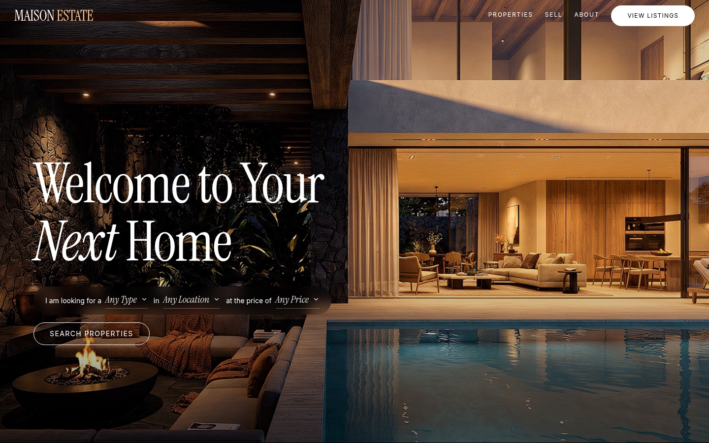
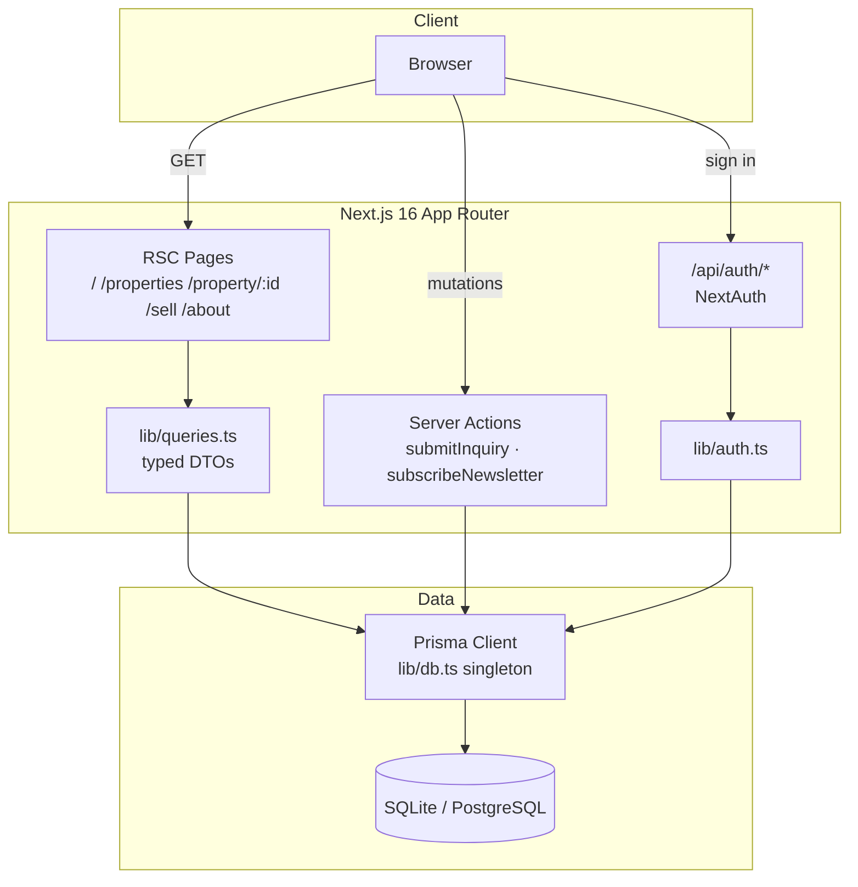

# MAISON ESTATE — Real Estate Agency


> A production-grade, enterprise-polished clone of the MAISON ESTATE luxury
> real-estate application — rebuilt on Next.js 16 with the original's exact
> editorial design language.

MAISON ESTATE is the definitive authority in luxury real estate: curated
collections of estates, penthouses, waterfront and modernist residences across
San Francisco's most coveted neighborhoods. This codebase rebuilds the
original Base44 application as a fully open, self-contained Next.js project —
same look and feel, same flows, engineering-grade foundations (typed data
layer, validated Server Actions, tested domain logic, seeded demo content).



## Key Features

| ✨ Feature | Description |
| --- | --- |
| 🎬 Video hero with sentence-style search | "I am looking for a **[Type]** in **[Location]** at the price of **[Price]**" — glassmorphic pill with serif-italic underlined dropdowns over the original's cinematic loop |
| 🏛️ Curated listings | 12 seeded luxury residences with galleries, stats (beds/baths/sqft/garage/year), features, virtual tours and Google Maps embeds |
| 🔎 URL-driven filters | Search, location, type, price band and beds — shareable, back/forward-safe |
| 🏷️ Rotating listing stamps | The signature animated "NEW" / "OPEN HOUSE" circular badges |
| 👔 Advisors & testimonials | Featured advisors with credentials; auto-rotating success stories |
| 📇 Lead capture | Inquiry form (tour / virtual tour / price / general) + newsletter, persisted via validated Server Actions with rate limiting |
| 🔐 Credentials auth | Slate auth-card sign-in seeded with the original demo user; Google button surfaced with graceful unconfigured notice |
| 📱 Responsive & accessible | Mobile overlay menu, keyboard-navigable controls, labeled forms, reduced-motion support |

## Architecture

| Layer | Technology | Version | Purpose |
| --- | --- | --- | --- |
| Framework | Next.js (App Router) | 16 | RSC pages, Server Actions, routing |
| UI runtime | React | 19 | Component model |
| Language | TypeScript (strict) | 5 | Type safety across the app |
| Styling | Tailwind CSS (CSS-first) | 4 | Design tokens + utilities, no config file |
| Components | shadcn/ui + Radix | — | Select, Input, Textarea primitives |
| Animation | framer-motion | 12 | Hero, reveals, badges, parallax |
| ORM | Prisma | 6 | Schema, client, seeding |
| Database | SQLite (dev) / PostgreSQL (prod) | — | Zero-config local; production path documented |
| Auth | NextAuth v4 | 4 | Credentials provider + optional Google |
| Validation | Zod | 4 | Server Action input contracts |
| Unit/integration tests | Vitest | 5 | Unit + action/query integration tests (real DB) |
| E2E tests | Playwright | 1.57 | Font/title/flow guards against the production build |
| Toasts | sonner | 2 | Inquiry/newsletter feedback |



## File Hierarchy

```text
📂 real-estate-agency/
├── 📂 docs/
│   └── 📂 screenshots/          # Production-build captures of every page
├── 📂 e2e/                      # Playwright e2e suite (fonts, titles, hero, flows)
├── 📂 prisma/
│   ├── 📄 schema.prisma         # Property/Agent/Testimonial/Inquiry/User models
│   └── 📄 seed.ts               # Idempotent seed (listings, advisors, demo user)
├── 📂 public/
│   └── 📂 media/                # Hero video, neighborhood/page imagery, listing photos
├── 📂 src/
│   ├── 📂 actions/
│   │   ├── 📄 inquiry.ts        # Server Actions — the only mutation seam
│   │   └── 📄 inquiry.test.ts   # Action integration tests (real DB)
│   ├── 📂 app/
│   │   ├── 📄 layout.tsx        # Fonts on <html> (Instrument Serif + Inter), metadata, toaster
│   │   ├── 📄 globals.css       # Design tokens — the MAISON design system
│   │   ├── 📄 page.tsx          # Home (hero, featured, neighborhoods, services…)
│   │   ├── 📂 properties/       # Listings + URL-driven filters
│   │   ├── 📂 property/[id]/    # Detail: gallery, stats, features, map, inquiry
│   │   ├── 📂 sell/             # Seller page + contact form
│   │   ├── 📂 about/            # Legacy, advisors, credentials, community
│   │   ├── 📂 login/            # Slate auth card (Google + credentials)
│   │   └── 📂 privacy|terms|accessibility/
│   ├── 📂 components/
│   │   ├── 📂 site/             # Header, footer, hero, dropdowns, cards, forms, stamps…
│   │   └── 📂 ui/               # shadcn primitives
│   ├── 📂 lib/                  # db client, queries (DTOs), constants, format
│   └── 📂 types/                # NextAuth augmentation
├── 📄 .env.example              # Every variable the app reads
├── 📄 AGENTS.md                 # Agent-facing instructions
├── 📄 CLAUDE.md                 # Engineering conventions & workflow
└── 📄 Project_Architecture_Document.md  # As-built architecture (PAD)
```

## Quick Start

Requires **Node.js ≥ 20** (or Bun ≥ 1.1) and the [Bun](https://bun.sh)
runtime for the documented commands.

```bash
git clone git@github.com:nordeim/real-estate-agency.git
cd real-estate-agency
bun install
cp .env.example .env
bun run db:push && bun run db:seed
bun run dev
```

**Verify setup**

1. Open <http://localhost:3000> — the video hero renders and "Featured
   Properties" shows six listings.
2. `bun run test` prints `3 passed (3) / 31 passed (31)`.
3. Sign in at <http://localhost:3000/login> with
   `sepnetflix2023@outlook.com` / `$Abcd1234` — you are redirected home.

Demo credentials are seeded on purpose to mirror the original application.

## Environment Variables

| Variable | Required | Default | Purpose |
| --- | --- | --- | --- |
| `DATABASE_URL` | ✅ | `file:./db/custom.db` | SQLite path, or a PostgreSQL URL (switch the Prisma provider to `postgresql` first) |
| `NEXTAUTH_SECRET` | ✅ | — | Session signing secret (`openssl rand -base64 32`) |
| `NEXTAUTH_URL` | ✅ | `http://localhost:3000` | Canonical origin for auth redirects |
| `GOOGLE_CLIENT_ID` | ⬜ | — | Enables Google sign-in when set with the secret + flag |
| `GOOGLE_CLIENT_SECRET` | ⬜ | — | Google OAuth client secret |
| `NEXT_PUBLIC_GOOGLE_ENABLED` | ⬜ | `false` | Activates the Google sign-in action (the button is always visible; without keys it shows a setup notice) |
| `NEXT_PUBLIC_SITE_URL` | ⬜ | `http://localhost:3000` | Metadata / OG origin |

## Testing

```bash
bun run test        # unit + integration (31 tests, real SQLite DB)
bun run test:e2e   # Playwright e2e (25 tests) — builds & boots the production
                   # standalone server on :3003; E2E_BASE_URL reuses a running one
bun run lint        # ESLint — must be clean
bun run typecheck   # tsc --noEmit — must be clean
```

Integration tests run the real Server Actions and query engine against the
local SQLite database (validation failures, rate limiting, not-found guards,
persistence, filter semantics). The e2e suite guards the font cascade, the
original app's page titles, the hero popover dropdowns, and the full user
flows — including inquiry/newsletter rows landing in the database and the
demo login.

## Screenshots

| Page | Capture |
| --- | --- |
| Home — hero | `docs/screenshots/01-homepage-hero.png` |
| Home — full page | `docs/screenshots/02-homepage-full.png` |
| Listings + filters | `docs/screenshots/03-properties-listings.png` |
| Property detail | `docs/screenshots/04-property-detail.png` |
| Sell | `docs/screenshots/05-sell-page.png` |
| About | `docs/screenshots/06-about-page.png` |
| Login | `docs/screenshots/07-login-page.png` |
| Mobile home | `docs/screenshots/08-mobile-homepage.png` |
| 404 | `docs/screenshots/09-not-found-page.png` |

## Deployment

Any Node host works. For production:

1. Switch `prisma/schema.prisma` to `provider = "postgresql"` and point
   `DATABASE_URL` at your instance.
2. Set `NEXTAUTH_SECRET`, `NEXTAUTH_URL`, and `NEXT_PUBLIC_SITE_URL` to the
   public origin.
3. `bun run db:push && bun run db:seed` (or migrations), then build and start
   with your host's Next.js flow.

## Project Status

| Phase | Status | Key Deliverables |
| --- | --- | --- |
| Recon & design extraction | ✅ Complete | Original tokens, routes, entities, media |
| Core build | ✅ Complete | All pages, actions, auth, seed data |
| Parity iteration | ✅ Complete | Font-cascade fix, hero popover dropdowns, section structures (neighborhoods/services/sell/about/footer/404/login), original page titles |
| Quality gates | ✅ Complete | lint/typecheck clean, 31 unit + 25 e2e tests, production build verified |
| Docs & delivery | ✅ Complete | README, AGENTS.md, CLAUDE.md, PAD, screenshots, .env.example |

## License

Provided as-is for the repository owner. Design and copy reference the
original MAISON ESTATE Base44 application; listing copy and demo data were
authored for this project.
